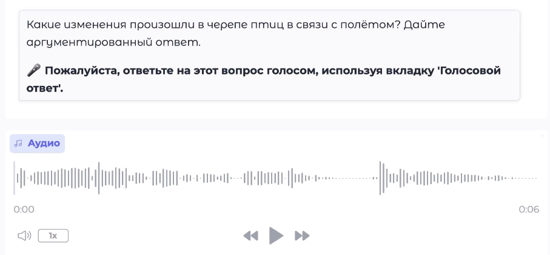
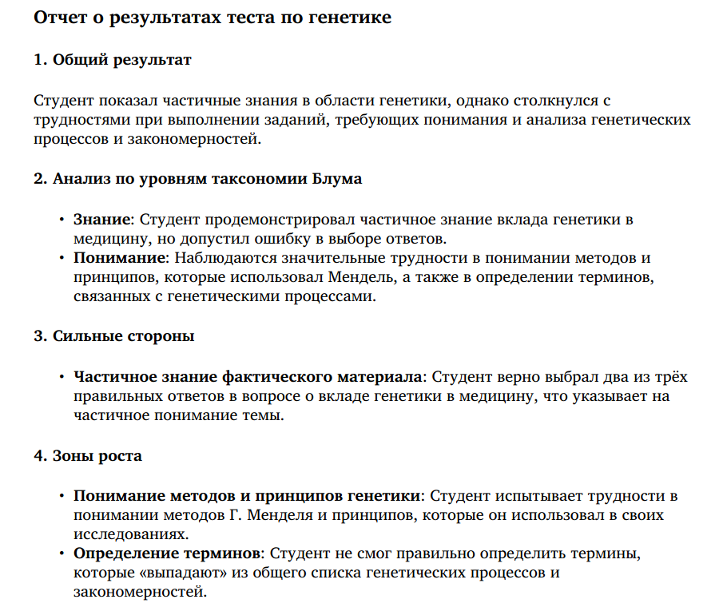
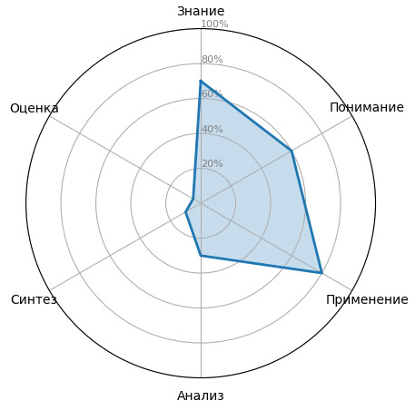
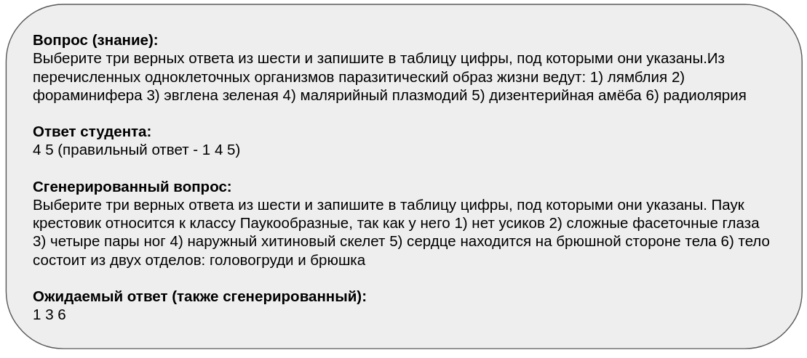

# Macan-Team

Introduction Hackathon for ITMO Masters - AI Talent Hub 2025-2027

# Launch


```bash
git clone https://github.com/Alex777Russia/sliding-knowledge-diagnostics.git
cd sliding-knowledge-diagnostics
```

To run a contnainer you will need to create ```.env``` file in current dir first. Write those variables:

```bash

FOLDER_ID=<your_yandex_api_folder_id>
YANDEX_API_KEY=<your_yandex_api_key>
OPENAI_API_KEY=<your_openai_api_key>

```

Also you need a database in current dir with name  ```data.csv``` format.

Our data base can be found [here](https://drive.google.com/file/d/12yJ3d6QjlIfn5PeJoCoc2uzocuh-AHpq/view?usp=sharing).

Start app:

```bash
bash docker/build.sh
bash docker/run.sh
```

Local app can be accessed by link ```http://0.0.0.0:7860``` (```localhost:7860```).

# Demo


# Project features

## 🎤 Voice Responses
- **Voice recording**: Students can answer questions by speaking through a microphone  
- **Audio upload**: Ability to upload audio files for transcription  
- **OpenAI Whisper**: Use of the OpenAI Whisper API for high-quality transcription  
- **Automatic recognition**: Audio is automatically transcribed into text  
- **Flexibility**: Supports both text and voice responses  
- **Russian language**: Optimized for recognizing Russian speech  



## 📊 PDF report generation

After exam report is generated as PDF file with some plots.




## ❓ Clarifying question generation

If student's answer is not clear, clarifying question will be generated.


